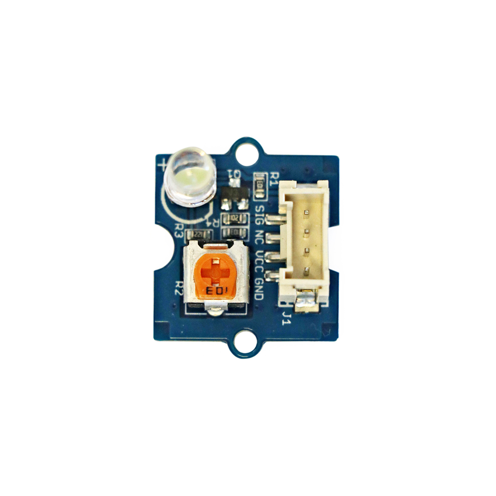

# LED-Sockel

## Beschreibung
LEDs (Leuchtdioden) dienen zur Beleuchtung aber auch zur Darstellung eines Zustandes. Viele Geräte sind mit LEDs ausgestattet. Diese zeigen dabei ausschließlich an, ob das Gerät eingeschaltet ist oder beispielsweise ein Fehler vorliegt. Bei Elektronik-Projekten kommen LEDs meistens zum Einsatz, um die Funktion von Sensoren zu testen. LEDs lassen sich auch direkt (mit zwischengeschaltetem Widerstand) an einen Mikrocontroller über einen digitalen Pin anschließen.

Die hier abgebildete LED ist direkt auf einer Platine mit einstellbarem Widerstand montiert, sodass sie mit Standard-Grove-Verbindungskabel und mithilfe eines Grove Shields an den entsprechenden Mikrocontroller angeschlossen werden kann. Um eine andere Farbe zu erhalten, lässt sich die Leuchtdiode auf der Platine auch austauschen. Hierbei muss man allerdings auf die richtige Polung der LED achten.

Das integrierte Potentiometer ist auch nützlich, um den richtigen Vorwiderstand für die entsprechende LED einzustellen. Darüberhinaus kann man so auch deren Helligkeit verändern.

Alle weiteren Hintergrundinformationen sowie ein Beispielaufbau und alle notwendigen Programmbibliotheken sind auf dem offiziellen Wiki (bisher nur in englischer Sprache) von Seeed Studio zusammengefasst. Zusätzlich findet man über alle gängigen Suchmaschinen meist nur mit der Eingabe der genauen Komponenten-Bezeichnungen entsprechende Projektbeispiele und Tutorials.

https://www.youtube.com/watch?v=ITsk6dPSsqA

<!-- infolist -->

<!-- infolists -->

## Wichtige Links für die ersten Schritte:

- [Seeed Studio Wiki](http://wiki.seeedstudio.com/Grove-LED_Socket_Kit/) [- LED Sockel](http://wiki.seeedstudio.com/Grove-LED_Socket_Kit/)

## Weiterführende Hintergrundinformationen:

- [GPIO - Wikipedia Artikel](https://de.wikipedia.org/wiki/Allzweckeingabe/-ausgabe)
- [LED - Wikipedia Artikel](https://de.wikipedia.org/wiki/Leuchtdiode)
- [Vorwiderstand - Wikipedia Artikel](https://de.wikipedia.org/wiki/Vorwiderstand)
- [Potentiometer - Wikipedia Artikel](https://de.wikipedia.org/wiki/Potentiometer)
- [GitHub-Repository: LED-Sockel](https://github.com/MakeYourSchool/64-LED-Sockel)

