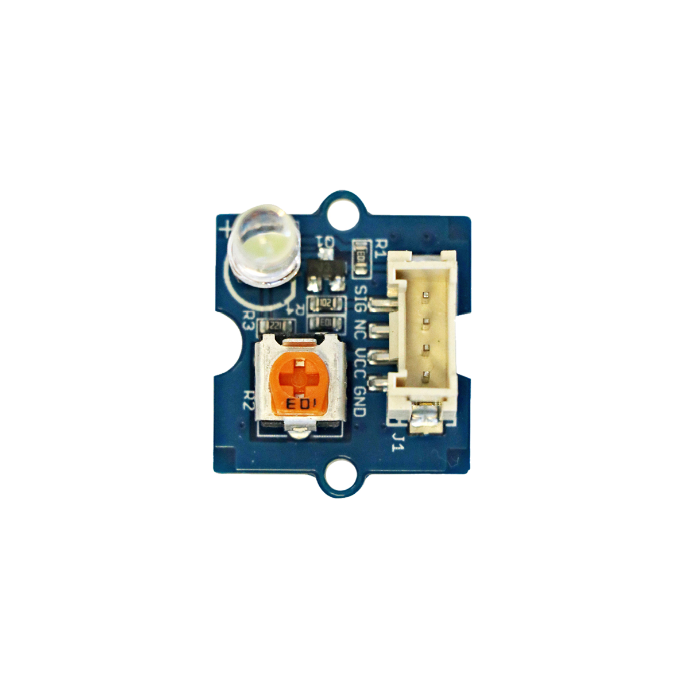
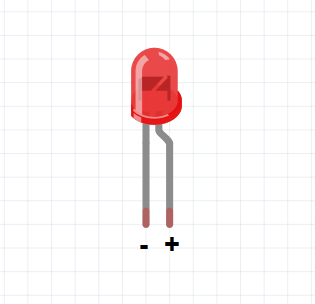
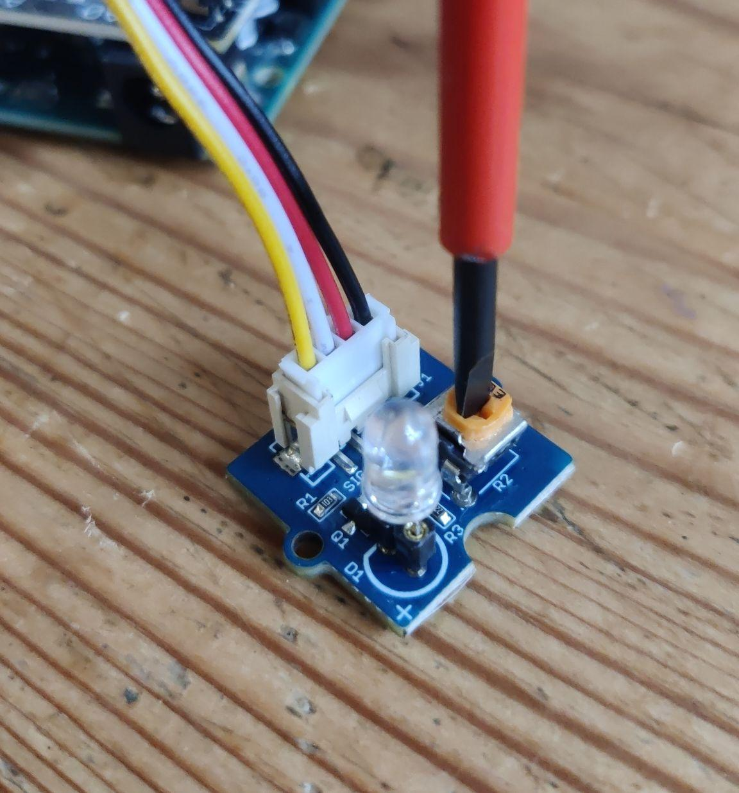

# LED-Sockel

## Beschreibung
LEDs (Leuchtdioden) dienen zur Beleuchtung aber auch zur Darstellung eines Zustandes (z.B. eine rot-leuchtende LED symbolisiert schlechte Luftqualität). Viele Geräte sind mit LEDs ausgestattet. Diese zeigen dabei ausschließlich an, ob das Gerät eingeschaltet ist oder beispielsweise ein Fehler vorliegt. Bei Elektronik-Projekten kommen LEDs meistens zum Einsatz, um die Funktion von Sensoren zu testen.

@[youtube](https://www.youtube.com/watch?v=ITsk6dPSsqA)

Normalerweise brauchen LEDs einen Widerstand, damit sie nicht durchbrennen. Praktischerweise hat dieser LED-Sockel schon eingebaute Widerstände, welche die LED davor schützen.

## Aufbau 

1. Nehme eine LED und stecke sie in den LED-Sockel hinein. Du kannst verschiedenfarbige LEDs hierfür nehmen! ⚠️ Hierbei muss man beachten, wie herum man sie reinsteckt, da der Strom durch LEDs nur in einer Richtung durchfließen kann. Nehme folgendes Bild zur Hilfe:  

1. Verbinde den LED-Sockel mit Grove-Kabel mit dem Grove-Shield auf dem Arduino. Für unser Beispiel nehmen wir den digitalen Pin `D2`. Siehe es hier im Bild:  

1. Füge den Beispielcode von unten ein und lade ihn auf den Arduino. Du solltest die LED blinken sehen.

**Helligkeit der LED ändern**  
Mit einem Kreuz-Schraubenzieher kann man kann die Helligkeit der LED ändern und heller oder dunkler stellen. Dahinter steckt ein Widerstand, der regelt, wieviel Strom durch die LED fließt. Mehr Strom = hellere LED, weniger Strom = dunklere LED.

## Weitere Informationen

Alle weiteren Hintergrundinformationen sowie ein Beispielaufbau und alle notwendigen Programmbibliotheken sind auf dem offiziellen Wiki (bisher nur in englischer Sprache) von Seeed Studio zusammengefasst. Zusätzlich findet man über alle gängigen Suchmaschinen meist nur mit der Eingabe der genauen Komponenten-Bezeichnungen entsprechende Projektbeispiele und Tutorials.

## Beispiele

!!!show-examples:./examples/

<!-- infolist -->

## Wichtige Links für die ersten Schritte:

- [Seeed Studio Wiki](http://wiki.seeedstudio.com/Grove-LED_Socket_Kit/) [- LED Sockel](http://wiki.seeedstudio.com/Grove-LED_Socket_Kit/)

## Weiterführende Hintergrundinformationen:

- [GPIO - Wikipedia Artikel](https://de.wikipedia.org/wiki/Allzweckeingabe/-ausgabe)
- [LED - Wikipedia Artikel](https://de.wikipedia.org/wiki/Leuchtdiode)
- [Vorwiderstand - Wikipedia Artikel](https://de.wikipedia.org/wiki/Vorwiderstand)
- [Potentiometer - Wikipedia Artikel](https://de.wikipedia.org/wiki/Potentiometer)
- [GitHub-Repository: LED-Sockel](https://github.com/MakeYourSchool/64-LED-Sockel)

